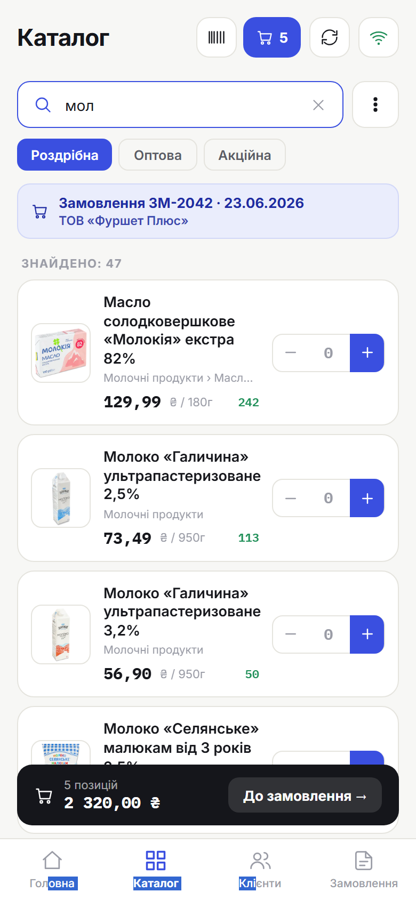
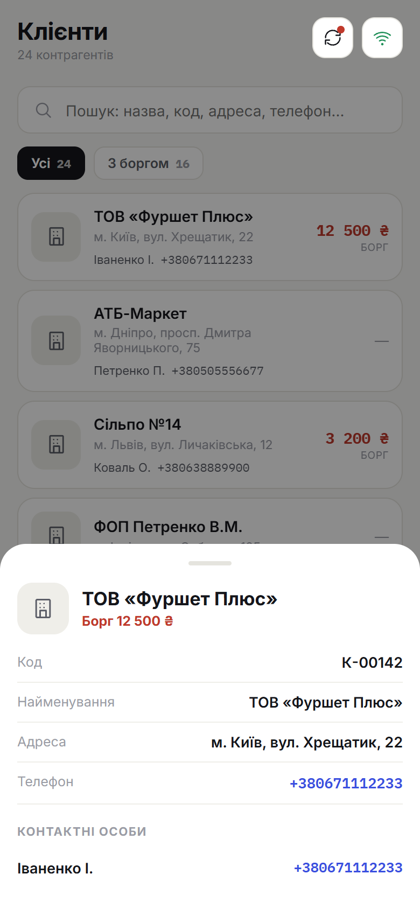

<p align="center">
  
</p>

<h1 align="center">Vendo</h1>

<p align="center">
  <b>Мобільний B2B-застосунок торгового представника — каталог, клієнти й замовлення «у полі», навіть без інтернету.</b><br/>
  Інтерфейс трьома мовами (uk/ru/en), документація — українською; offline-first, Android через Capacitor.
</p>

<p align="center">
  <a href="https://github.com/Lion-killer/Vendo/releases"></a>
  <a href="https://github.com/Lion-killer/Vendo/actions/workflows/lint.yml"></a>
  
  
  
</p>

---

## ✨ Ключові можливості

| | |
|---|---|
| 📷 **QR-прив'язка пристрою** | Скануєш QR з 1С — і працюєш: без паролів; сесія переживає перезапуск застосунку |
| 🛒 **Каталог** | Фото, категорії, пошук і сканер штрихкодів — знайдений товар одразу додається в замовлення |
| 💰 **Типи цін** | Селектор у каталозі, одне замовлення — один тип цін, перерахунок із підтвердженням; ціна фіксується в момент додавання позиції |
| 👥 **Клієнти** | Дерево папок як у довіднику 1С, наскрізний пошук; картка з боргом, контактами та історією замовлень |
| 🔁 **Повтор замовленого** | Підсвітка товарів, які клієнт уже брав; свайп відкриває останні кількості для швидкого повтору |
| ✈️ **Офлайн** | Повноцінна робота без мережі: чернетки, локальна черга, синхронізація кнопкою, розв'язання конфліктів правок |
| 🔄 **Самооновлення** | Застосунок знаходить свіжий реліз на GitHub і сам встановлює APK з прогрес-баром |
| 📊 **Телеметрія** | Оператор бачить у 1С версію, чергу, помилки та добове навантаження кожного пристрою; повний лог — на запит |
| 🌍 **І ще** | Вбудована офлайн-довідка, темна тема, мови uk/ru/en |

## 📸 Скриншоти

| | | |
|:---:|:---:|:---:|
| **Головний екран** | **Каталог: пошук** | **Свайп: історія кількостей** |
|  |  |  |
| **Картка клієнта** | **Замовлення** | **Статуси та конфлікти** |
|  |  |  |

Більше кадрів — у [посібнику користувача](docs/user-guide/README.md).

## 🔌 Контракт API — основа

Серцем проєкту є **єдиний REST-контракт**, проти якого написаний застосунок. Канонічне джерело — [`backend/mock/openapi.json`](backend/mock/openapi.json) (Swagger UI на `/api/docs`). Бекенд **змінний**: підійде будь-яка реалізація контракту. Доступні варіанти:

- **Демо-сервер** `backend/mock/` (Node + Express, in-memory) — еталонна реалізація контракту для локальної розробки/тесту; авторизація імітована, дані з фікстури `db.json`.
- **Інтеграція з 1С** `backend/1c-config/` — один із можливих варіантів: HTTP-сервіс у міні-конфігурації, що об'єднується з «Управление торговлей для Украины» 2.3 (реальні номенклатура/ціни/залишки/контрагенти/замовлення). Дані скоупляться на пристрій: довідник «Мобільні пристрої» задає склад, валюту, типи цін, білі списки контрагентів/товарів і глибину історії замовлень; за налаштуванням пристрою замовлення може одразу проводитись і породжувати «Реалізацію товарів та послуг». Авторизація — одноразовий код прив'язки → bearer-токен (у базі зберігається лише SHA-256-хеш); адміністрування — з форм УТ, без Конфігуратора.

Контракт первинний; будь-який інший сервіс, що його реалізує, теж працюватиме.

## 🧰 Стек

| Частина | Технології |
|---|---|
| **Demo backend** | Node.js + Express 5, in-memory (сід із `db.json`) |
| **1C backend** | HTTP-сервіс 1С (BSL), УТ для України 2.3, платформа 8.3.x (режим сумісності 8.2.13) |
| **Frontend** | React 17, Vite 8, i18next (uk/ru/en), inline-стилі (без CSS-фреймворку) |
| **Mobile** | Capacitor 8, Android 8.0+ (minSdk 26): App, Filesystem, Share, BarcodeScanner + власний плагін ApkInstaller (оновлення) |

## 🗂️ Структура

```
Vendo/
├─ backend/                # контейнер бекендів одного REST-контракту
│  ├─ mock/                # мок-бекенд: Node + Express, in-memory (для dev/тесту)
│  │  ├─ server.js         #   точка входу (порт 3000)
│  │  ├─ db.js             #   in-memory стор (сід із db.json при старті)
│  │  ├─ routes/api.js     #   ендпоінти (усі мутації в пам'яті, атомарні)
│  │  ├─ lib/              #   чисті хелпери (ціни, валюти, сумісність) + юніт-тести
│  │  ├─ openapi.json      #   контракт (Swagger UI на /api/docs)
│  │  └─ data/db.json      #   сід-фікстура
│  └─ 1c-config/TradeUkr23/       # справжній бекенд: міні-конфіг 1С для УТ 2.3
│     ├─ README.md         #   довідник «Мобільні пристрої» — для оператора УТ
│     ├─ DEVELOPER.md      #   вбудування в УТ, API, реалізація — для розробника
│     ├─ iis/              #   публікація на IIS: взірці web.config і default.vrd
│     └─ src/HTTPServices/венд_МобильноеПриложение/   # HTTP-сервіс: /auth, /products, /orders…
├─ frontend/               # React + Vite (+ Android-проект Capacitor)
│  ├─ src/
│  │  ├─ App.jsx           # оркестратор: навігація, стан, offline/sync-логіка
│  │  ├─ api/              # REST-клієнт, локальна черга, кеш зображень, історія sync
│  │  ├─ screens/          # login, dashboard, catalog, customers, order, ordersList, help
│  │  ├─ components/       # ui.jsx (набір MIcon/BottomNav/Card…), Icon, LogPanel…
│  │  ├─ logger.js         # журнал роботи + надсилання логу («Поділитися»)
│  │  ├─ i18n.js, locales/ # локалізація uk/ru/en
│  │  └─ theme.js          # токени світлої/темної теми
│  ├─ android/             # нативний Android-проект Capacitor: gradle, підпис APK, плагін ApkInstaller
│  ├─ scripts/             # release, sync-version, changelog, copy-help, screenshots
│  └─ releases/            # локальні копії підписаних APK (gitignored; канон — GitHub Releases)
├─ docs/user-guide/        # посібник користувача (єдине джерело; вшивається в APK як довідка)
├─ design/                 # бандл редизайну з Claude Design (design/project/, ще не впроваджено)
└─ start.bat               # запуск backend + frontend (Windows)
```

## 📚 Документація

- [Посібник користувача](docs/user-guide/README.md) — для торгового агента (він же — вбудована довідка в застосунку)
- [1С: довідник «Мобільні пристрої»](backend/1c-config/TradeUkr23/README.md) — для оператора УТ
- [1С: для розробника](backend/1c-config/TradeUkr23/DEVELOPER.md) — вбудування в УТ, реалізація сервісу
- [Публікація HTTP-сервісу на IIS](backend/1c-config/TradeUkr23/iis/README.md) — налаштування веб-шару, взірці
- [CHANGELOG.md](CHANGELOG.md) — історія релізів

## 🚀 Запуск (демо-бекенд)

Потрібен Node.js 20.19+ (вимога Vite 8); самому мок-бекенду досить 18+.

### Швидкий старт (Windows)
```bat
start.bat
```
Підніме backend (http://localhost:3000) і frontend (http://localhost:5173).

### Вручну
```bash
cd backend/mock && npm install && npm start  # API на :3000, контракт на /api/docs
cd frontend && npm install && npm run dev -- --host
```
При старті `db.js` сідить дані з `data/db.json` у пам'ять (без файлу БД).
Змінна `MOCK_CURRENCY` (напр. `840`) перемикає валюту демо-пристрою — мок
конвертує гривневі ціни фікстури за демо-курсами, імітуючи 1С.

### Збірка та Android
```bash
cd frontend
npm run build          # → dist/
npx cap sync android   # синхронізувати веб-збірку + нативні плагіни в Android-проект
```

### Реліз і оновлення додатка
```bash
cd frontend
npm run release                        # авто: !/BREAKING → major, feat → minor, інакше patch
npm run release -- patch|minor|major   # або явний тип
```
Версія живе в `frontend/package.json` (єдине джерело): скрипт релізу синхронізує її
в Android (`versionName`/`versionCode`), у міні-конфігурацію 1С і мок-бекенд,
генерує розділ у `CHANGELOG.md` (з conventional-комітів від останнього тега),
комітить і ставить git-тег; той самий розділ стає нотатками GitHub-релізу.
Підпис — локальний keystore (`android/vendo-release.keystore` +
`android/keystore.properties`, обидва поза git; створюються при першому релізі —
**зробіть бекап обох**). Застосунок сам перевіряє
[GitHub Releases](https://github.com/Lion-killer/Vendo/releases) раз за сесію
(анонімно, репозиторій публічний) і пропонує оновлення при старті й у меню профілю:
на Android APK завантажується з прогрес-баром і ставиться через системний
інсталятор (власний плагін ApkInstaller), у браузері — відкривається посилання на APK.

### Адреса бекенду

Резолвиться в [`src/api/client.js`](frontend/src/api/client.js) у такому порядку:

1. **QR-код** при вході — зберігається в `localStorage` (`vendo_api_url`). Основне джерело в проді: одна збірка APK → різні сервери без перезбірки.
2. **`VITE_API_URL`** з `frontend/.env` — дефолт для локальної розробки (копіюй з [`.env.example`](frontend/.env.example); сам `.env` у `.gitignore`).
3. **Хардкод-фолбек** `http://10.0.2.2:3000/api` — щоб dev на емуляторі працював без `.env`.

На пристрої запити йдуть через нативний HTTP-шар Capacitor (`CapacitorHttp`),
тому `http://`-адреси з QR-кода працюють без обмежень WebView (mixed content, CORS).

Підказки для `VITE_API_URL`:
- **Браузер на тому ж ПК:** `http://localhost:3000/api`
- **Android-емулятор:** `http://10.0.2.2:3000/api` (хост видно як `10.0.2.2`)
- **Реальний пристрій:** LAN IP хоста, напр. `http://192.168.1.50:3000/api`

## 🛠️ Розробка

- **Тести:** `cd backend/mock && npm test` і `cd frontend && npm test` — stdlib `node --test`, без тестових залежностей.
- **Лінт:** `npm run lint` з кореня (oxlint по `frontend/src` і `backend/mock`); GitHub Actions ганяє його на кожен push у `main` і кожен PR (`--deny-warnings`).
- **Гард контракту:** pre-commit-хук (`.githooks/`, вмикається `npm install` у корені) ганяє `backend/mock/contract.test.mjs` — несумісна зміна `openapi.json` без підняття `minAppVersion` чи розсинхрон мінімальної версії додатка між мок і 1С зупиняє коміт.
- **Скриншоти довідки:** `cd frontend && npm run screenshots` — детерміновані кадри посібника (headless Chromium/Playwright; потрібні підняті :3000 і :5173).

## 📡 API

Базовий шлях: `/api` (демо) або `…/hs/vendo` (1С). Повний контракт — `backend/mock/openapi.json` (Swagger UI на `/api/docs`).

| Метод | Шлях | Опис |
|---|---|---|
| `POST` | `/auth` | Обмін одноразового коду прив'язки на bearer-токен (1С); у демо — стаб |
| `GET`/`HEAD` | `/health` | Дешева перевірка доступності; GET віддає версію бекенду, `minAppVersion` та інтервали фонових циклів додатка |
| `GET` | `/products` | Номенклатура пристрою (ціни за типами цін, залишок за складом, штрихкод, фото); `?ids=` — лише вказані товари |
| `GET` | `/products/{id}/image` | Бінарне фото товару (`?v=` — інвалідація кешу) |
| `GET` | `/categories` | Категорії |
| `GET` | `/price-types` | Типи цін пристрою (нове замовлення без `priceType` відхиляється з 400) |
| `GET` | `/customers` | Контрагенти пристрою (адреса/телефон/контактні особи/борг) |
| `GET` | `/customer-groups` | Папки довідника контрагентів (дерево клієнтів) |
| `GET` | `/customers/{id}/ordered-products` | Товари, які контрагент будь-коли замовляв (підсвітка в каталозі) |
| `GET` | `/orders` | Замовлення за період (`?startDate=&endDate=`), скоуп за контрагентами пристрою |
| `POST` | `/orders` | Upsert замовлення за клієнтським GUID (ідемпотентно) |
| `PUT` | `/orders/{id}` | Оновити замовлення (за GUID) |
| `DELETE` | `/orders/{id}` | Залежить від статусу замовлення: нове видаляється назавжди, відправлене — лише помічається на видалення, проведене видалити не можна (409) |
| `POST` | `/telemetry` | Снапшот стану пристрою (версія, черга, помилки, лічильник запитів; повний лог — на запит оператора) |

Авторизація: заголовки `X-Device-Id` + `X-Auth-Token` (Authorization платформа 1С перехоплює для ІБ). Додаток також шле `X-App-Version` — версію, нижчу за `minAppVersion` бекенду, data-ендпоінти відхиляють кодом 426 («оновіть додаток»). Мова відповіді — за `Accept-Language`.

## 🏗️ Особливості архітектури

- **Контракт-орієнтованість.** Будь-яка реалізація контракту віддає однаковий JSON; замовлення зберігаються нормалізовано (посилання), а на віддачі гідратуються (товари/клієнт/сума).
- **Ідентичність за GUID.** Клієнтський GUID замовлення = його ідентифікатор на бекенді → ідемпотентний upsert офлайн-черги (у 1С GUID стає посиланням документа).
- **Offline-first.** Дані кешуються в IndexedDB (колекції + фото товарів); інтервали фонових циклів (синхронізація даних / пінг / телеметрія) задає бекенд у відповіді `/health` — налаштовуються централізовано, без інтервалів цикли вимкнені; чернетки/правки/видалення/відновлення складаються в локальну чергу й відсилаються кнопкою синхронізації.
- **Розв'язання колізій.** Оптимістична конкуренція за токеном версії запису (409 зі станом сервера), діалог «перезаписати / взяти серверне», заборона редагувати/видаляти проведене, версія-гард на видалення/відновлення. Демо-бекенд реалізує гарди спрощено (перевірка версії лише при upsert) — повна реалізація в 1С.
- **Керована сумісність версій.** Бекенд декларує мінімальну версію додатка (застарілий отримує 426 і екран «оновіться»), додаток знає мінімальну повну версію бекенду (жовтий банер обмеженого режиму); свіжий APK підтягується з GitHub Releases прямо в застосунку.
- **Повільний бекенд ≠ офлайн.** Онлайн-статус визначає лише дешевий пінг `/health`; таймаути data-запитів адаптивні per-ендпоінт (остання виміряна TTFB × 3 у межах 25–120 с, калібруються в обидва боки й переживають перезапуск).
- **Діагностика.** Журнал роботи додатку з надсиланням розробнику через «Поділитися» (zip); історія синхронізацій (прогони + per-order результат); `ErrorBoundary` замість «білого екрана»; телеметрія пристроїв на бекенді (версія, черга, помилки, кількість запитів за добу, дистанційний запит логу зі списку пристроїв 1С).
- **Локалізація** uk/ru/en (автовизначення + ручне перемикання), формати дат/чисел/валюти.

## ♻️ Скидання демо-даних

Дані тримаються в пам'яті — просто **перезапустіть** backend: при старті він заново
сідить із `db.json` (чистий стан). Файлів БД немає.
