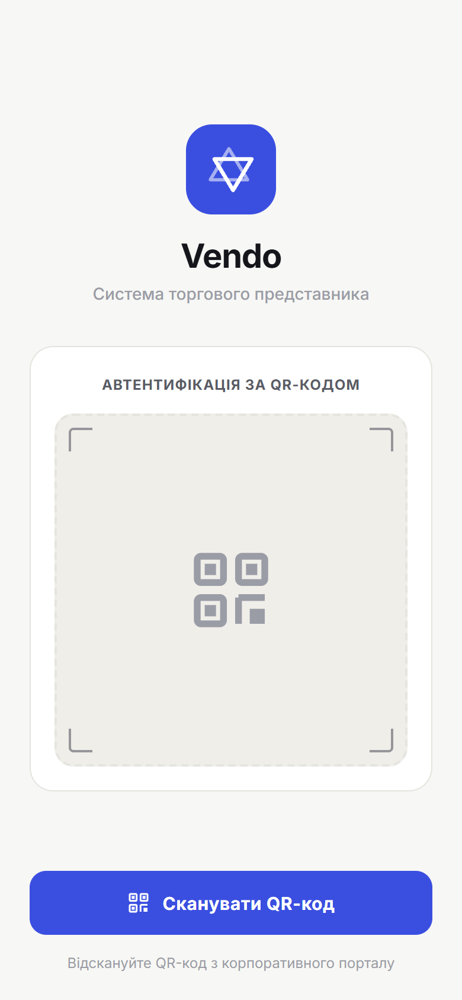

# 0. Початок роботи (вхід)

> **Коли це потрібно:** перший запуск додатку або після виходу з акаунта.

## Що дасть адміністратор
Вхід — **за QR-кодом**. Адміністратор покаже (на екрані 1С або роздрукує) QR-код твого пристрою. У ньому вже зашиті адреса сервера та одноразовий код прив'язки — нічого вручну вводити не треба.

## Кроки
1. Відкрий додаток — одразу запускається екран входу зі сканером.

2. Наведи камеру на QR-код, тримай рівно, поки він не розпізнається. `[скріншот: наведення на QR]`
3. Побачиш підтвердження й автоматично потрапиш на головний екран. `[скріншот: успішний вхід]`

## Результат
Відкривається головний екран; каталог, клієнти та замовлення підвантажуються з офісу.

## Якщо не вийшло
- **Немає доступу до камери** — дозволь додатку камеру в налаштуваннях телефона.
- **«Невірний або використаний код»** — код прив'язки одноразовий; попроси адміністратора згенерувати **новий** QR.
- **Помилка зв'язку** — перевір інтернет і спробуй ще раз.
