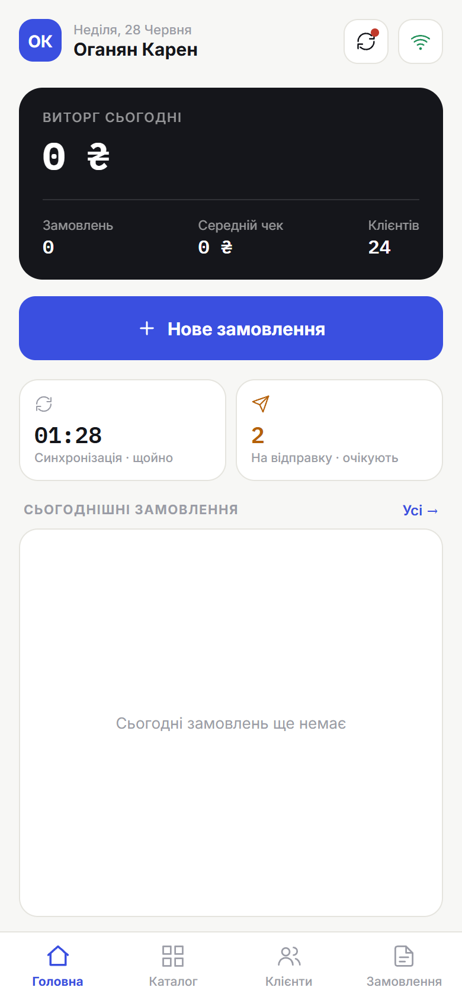

# 1. Огляд екрана

> **Коли це потрібно:** щоб орієнтуватися в додатку.

## Головний екран

- **Показники за сьогодні:** виторг, кількість замовлень, середній чек, клієнтів.
- **«Нове замовлення»** — почати оформлення.
- Картка **«Синхронізація»** — час останньої синхронізації (тап = синхронізувати).
- **Сьогоднішні замовлення** — швидкий список; «Усі →» відкриває розділ Замовлення.

## Верхня панель
- **Значок інтернету** — показує онлайн/офлайн. `[скріншот: онлайн vs офлайн]`
- **Кнопка синхронізації ⟳** — відправляє твої замовлення в офіс. **Червона крапка** = є невідправлені.

## Нижня навігація
`[скріншот: нижня панель]`
**Головна · Каталог · Клієнти · Замовлення** — головні розділи додатку.

## Меню профілю
Натисни **аватар** (кружок з ініціалами) угорі ліворуч на головній — там: тема (світла/темна), мова, **Історія синхронізацій**, **Журнал помилок**, **Очистити дані**, **Вийти**.

## Кнопка «Назад» (Android)
Апаратна «Назад» повертає на попередній екран усередині додатку; з головного екрана — виходить із додатку.
