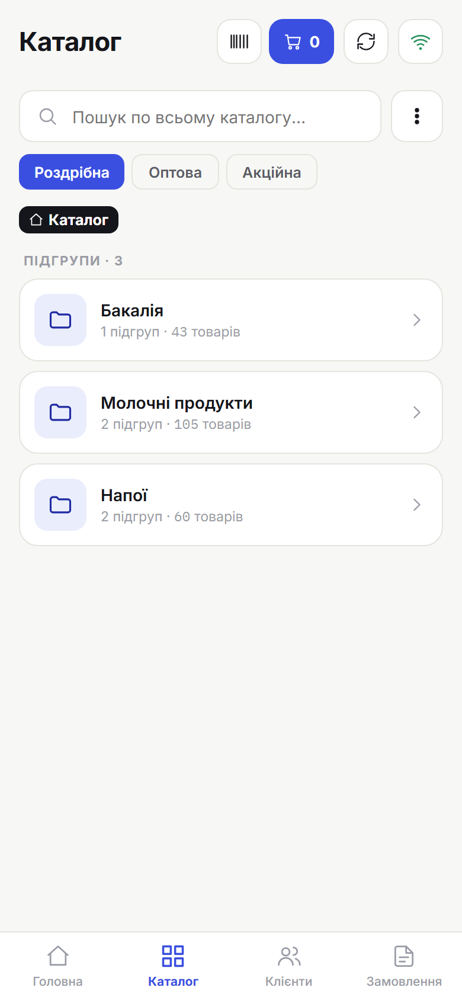
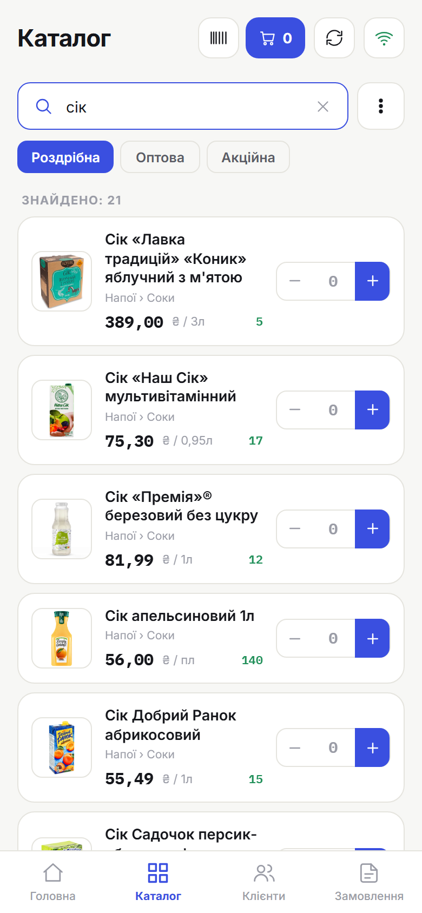
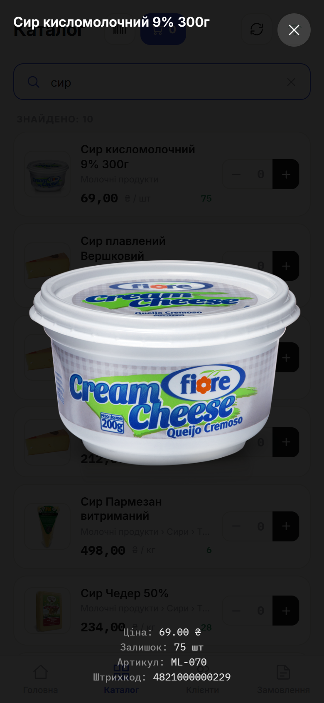

# 2. Каталог товарів

> **Коли це потрібно:** знайти товар і додати його до замовлення.

## Як відкрити
Нижня навігація → **Каталог**.

## Знайти товар
- **Перегляд груп:** заходь у групи й підгрупи; стрілка «назад» (угорі або апаратна) повертає на рівень вище.
- **Пошук:** введи назву, артикул або штрихкод у полі пошуку.
- **Сканер штрихкодів:** натисни значок сканера й піднеси камеру до штрихкоду товару.

## Тип ціни
Якщо для пристрою налаштовано **кілька типів цін**, під пошуком зʼявляється ряд чіпів
(напр. «Роздрібна», «Оптова»). Тапни потрібний — ціни в каталозі одразу перерахуються.
Якщо тип один — селектор не показується.

**Одне замовлення — один тип цін.** Поки кошик порожній, тип перемикається вільно. Коли
в замовленні вже є товари й ти вибираєш **інший** тип:
- застосунок спитає, чи **перерахувати** ціни замовлення на новий тип (**«Перерахувати»** —
  так, **«Лишити поточний»** — залишити як є);
- якщо на якийсь із доданих товарів **немає ціни** нового типу — перемикання **не відбудеться**,
  а застосунок назве ці товари: прибери їх або лишись на поточному типі.

Якщо для товару немає ціни вибраного типу, у рядку замість ціни видно **«Немає ціни»** —
такий товар додати не можна (обери інший тип або зверни увагу оператора на прайс).

> **Порядок товарів.** Товари **без залишку** показуються **в кінці** списку (і в групі, і в пошуку) — доступні до продажу завжди зверху.

## Картка товару
У рядку товару видно ціну та залишок. Натисни на фото, щоб відкрити його на весь екран — там назва, артикул, штрихкод, залишок і **ціни за всіма типами** (активний тип виділено; для типу без ціни — «немає ціни»). Зручно назвати клієнту всі ціни, не перемикаючи типи в каталозі. Якщо фото немає або воно ще вантажиться — відкриється відповідне повідомлення.

## Додати до замовлення
Вкажи кількість і додай товар. Угорі зʼявиться лічильник позицій і сума поточного замовлення.

## Результат
Товар у поточному замовленні. Далі — [оформлення замовлення](04-order-create.md).

## Поради
- Фото підвантажуються **у фоні**. Поки фото немає — показуються **три крапки** (це не помилка). Раніше переглянуті фото доступні навіть офлайн.
