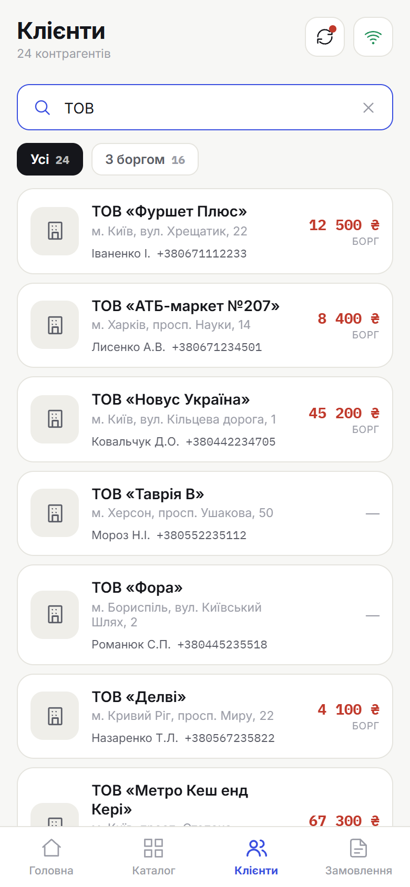
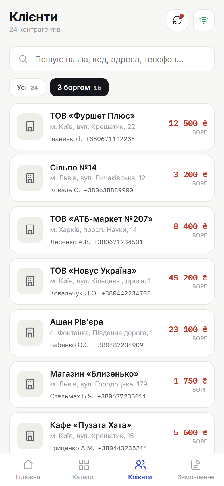

# 3. Клієнти

> **Коли це потрібно:** обрати клієнта або переглянути його дані / борг.

## Як відкрити
Нижня навігація → **Клієнти**. Список — це контрагенти, закріплені за твоїм пристроєм.

## Пошук і фільтр
- **Пошук** угорі: за назвою, кодом, адресою або телефоном.
- **Фільтр «З боргом»** — показати лише клієнтів із заборгованістю (поряд із «Усі»).

## Картка клієнта
Натисни на клієнта, щоб відкрити деталі: назва, код, адреса, телефони, контактні особи та борг/переплата.

### Замовлення клієнта
Нижче в картці — розділ **«Замовлення»** з історією замовлень цього клієнта
(номер, дата, сума, статус). Натисни на замовлення, щоб відкрити його.

## Результат
Бачиш повні дані клієнта; його можна обрати при оформленні замовлення.

## Поради
- У списку борг праворуч: **червоним** — заборгованість, **зеленим** — переплата, **«—»** — нуль.
