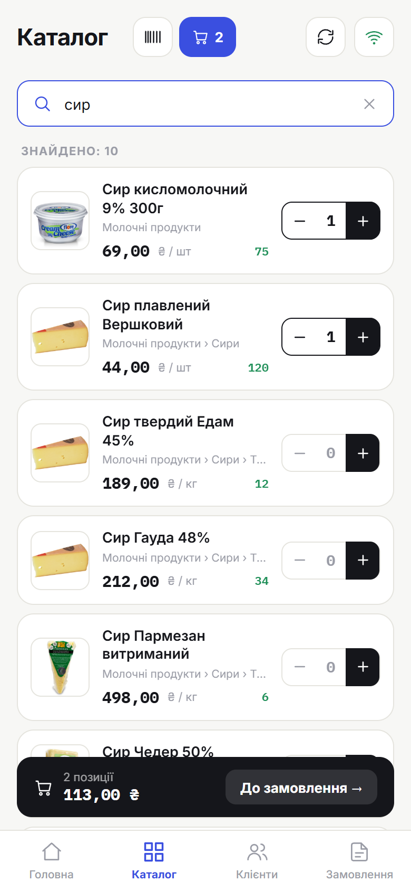
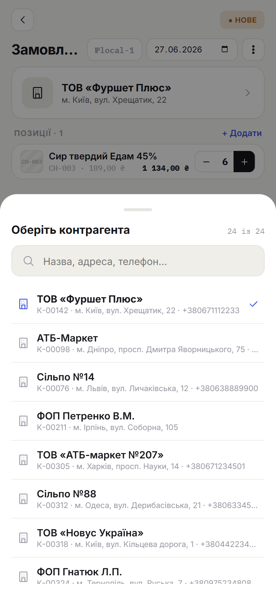

# 4. Оформлення замовлення

> **Коли це потрібно:** створити нове замовлення клієнту.

Замовлення спочатку **зберігається в додатку** (у списку «Мої замовлення»), а в офіс потрапляє після **синхронізації**. Тож порядок такий: набрати товари → вказати клієнта → **Зберегти** → **Синхронізувати**.

## Крок 1. Додай товари
Є два шляхи:
- з головного екрана натисни **«Нове замовлення»**, або
- відкрий **Каталог** і додавай товари прямо звідти.

Знайди товар (групи або пошук), вкажи кількість і додай до замовлення. Угорі видно поточну кількість позицій і суму.

## Крок 2. Признач клієнта
Внизу каталогу зʼявиться панель поточного замовлення — натисни **«До замовлення →»**, потім обери клієнта зі списку.

## Крок 3. Перевір і збережи
Перевір позиції, кількості та суму **«До сплати»** внизу. Натисни **«Зберегти»**.

## Крок 4. Відправ у офіс
Замовлення з'явиться в **«Мої замовлення»** зі статусом **Нове** і позначкою **очікує**. Щоб воно пішло в офіс, натисни **Синхронізацію** (значок ⟳ угорі) за наявності інтернету — статус зміниться на **Відправлено**.

## Результат
Замовлення збережене; після синхронізації — відправлене в офіс.

## Поради
- Якщо вийдеш з екрана з товарами — чернетка **збережеться автоматично**.
- **«Скопіювати в нове»** — швидко повторити замовлення тим самим клієнтом (товари й клієнт залишаються).
- Без інтернету все одно можна зберігати замовлення — вони почекають у черзі (див. [розділ 6](06-offline.md)).
