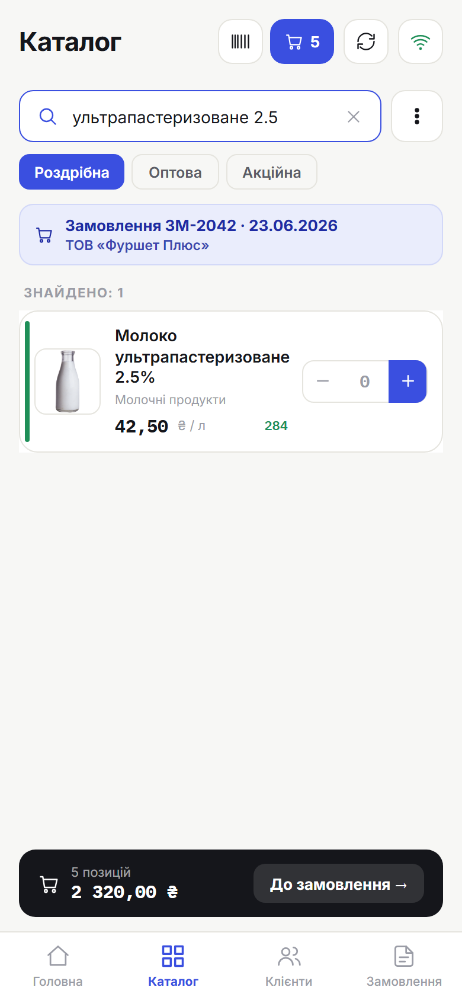

# 4. Оформлення замовлення

> **Коли це потрібно:** створити нове замовлення клієнту.

Замовлення спочатку **зберігається в додатку** (у списку «Мої замовлення»), а в офіс потрапляє після **синхронізації**. Тож порядок такий: набрати товари → вказати клієнта → **Зберегти** → **Синхронізувати**.

## Крок 1. Додай товари
Є два шляхи:
- з головного екрана натисни **«Нове замовлення»**, або
- відкрий **Каталог** і додавай товари прямо звідти.

Знайди товар (групи або пошук), вкажи кількість і додай до замовлення. Угорі видно поточну кількість позицій і суму.

> **Велика кількість.** Замість того щоб клацати **−/+**, **тапни по числу** між кнопками — відкриється цифрова клавіатура, введи потрібну кількість (наприклад, `1000`) і натисни **Готово**. Так само правиться кількість і в самому замовленні. У каталозі ввід `0` прибирає товар із замовлення.

## Крок 2. Признач клієнта
Внизу каталогу зʼявиться панель поточного замовлення — натисни **«До замовлення →»**, потім обери клієнта. Список клієнтів **згрупований у папки** (як у розділі «Клієнти») — заходь у теки або скористайся пошуком по всіх папках одразу.

## Раніше замовлені товари
Коли в замовленні відомий клієнт (нове з вибраним клієнтом або редагування наявного), у каталозі товари, які цей клієнт **уже замовляв раніше**, позначені **зеленою смужкою** ліворуч у рядку — одразу видно, що позиція для нього не нова. Ознака береться з **усієї історії** замовлень на сервері (навіть якщо в списку зараз видно лише останні).

**Свайп по зеленій смужці управо** розкриває її в історію: кілька останніх замовлень цієї позиції цим клієнтом — з **кількістю й датою**. Тапни по кількості, щоб одразу підставити її в поле кількості.

## Крок 3. Перевір і збережи
Перевір позиції, кількості та суму **«До сплати»** внизу. Натисни **«Зберегти»**.

> **Коментар до замовлення.** Меню **«⋮»** (угорі праворуч) → **«Коментар»** — впиши примітку (побажання клієнта, домовленість про доставку/оплату). Коли коментар є, у шапці замовлення й у списку «Мої замовлення» зʼявляється значок 💬. Коментар іде в офіс разом із замовленням.

## Крок 4. Відправ у офіс
Замовлення з'явиться в **«Мої замовлення»** зі статусом **Нове** і позначкою **очікує**. Щоб воно пішло в офіс, натисни **Синхронізацію** (значок ⟳ угорі) за наявності інтернету — статус зміниться на **Відправлено**.

## Результат
Замовлення збережене; після синхронізації — відправлене в офіс.

## Поради
- Якщо вийдеш з екрана з товарами — чернетка **збережеться автоматично**.
- **«Скопіювати в нове»** — швидко повторити замовлення тим самим клієнтом (товари й клієнт залишаються).
- Без інтернету все одно можна зберігати замовлення — вони почекають у черзі (див. [розділ 6](06-offline.md)).
