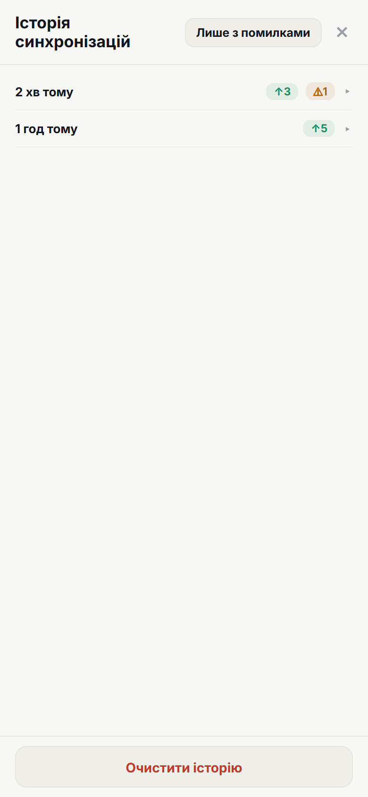
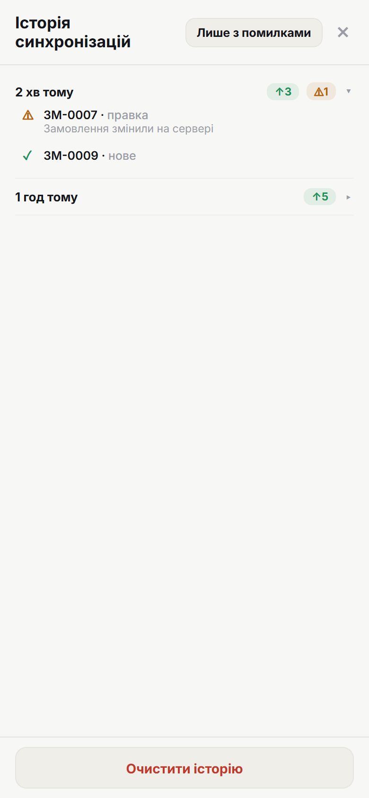

# 8. Історія синхронізацій

> **Коли це потрібно:** перевірити, що саме надіслалось і що не пройшло.

## Як відкрити
Головна → **аватар** (меню профілю) → **Історія синхронізацій**.

## Що показує
Список **прогонів синхронізації** (найновіші зверху). У кожному рядку — час і підсумок результату чипами:

- **↑ N** — надіслано (зелений),
- **⚠ N** — конфлікти (помаранчевий),
- **✗ N** — помилки (червоний),
- **⤼ N** — пропущено (сірий).

## Деталі прогону
Натисни на рядок, щоб розгорнути **кожне замовлення** прогону: номер, дія (нове / правка / видалення / відновлення), результат і повідомлення.

З рядка, що **з конфліктом або помилкою**, можна одразу **перейти в замовлення** й вирішити проблему. `[скріншот: перехід у замовлення]`

## Додатково
- **«Лише з помилками»** — сховати успішні прогони.
- **«Очистити історію»** — прибрати всі записи (з підтвердженням).
