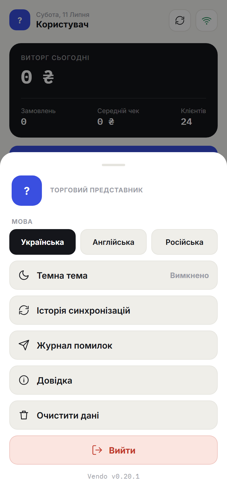
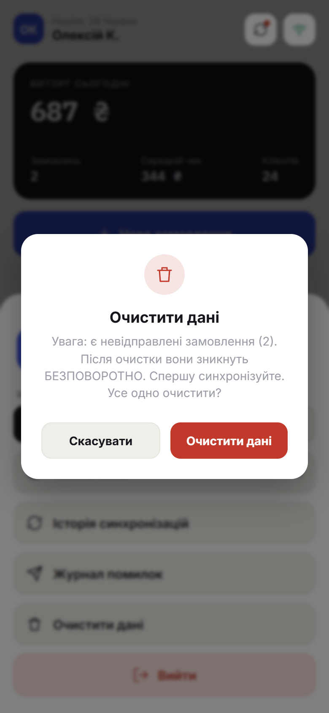
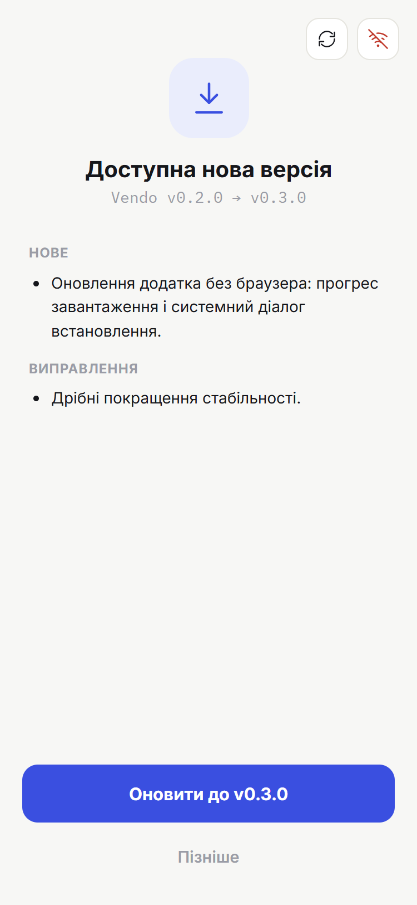
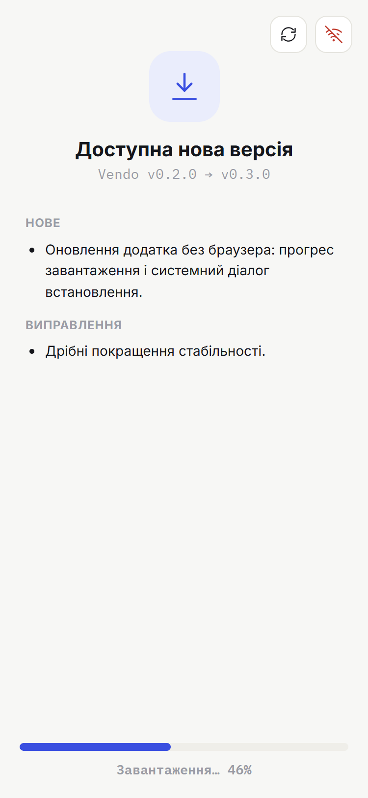
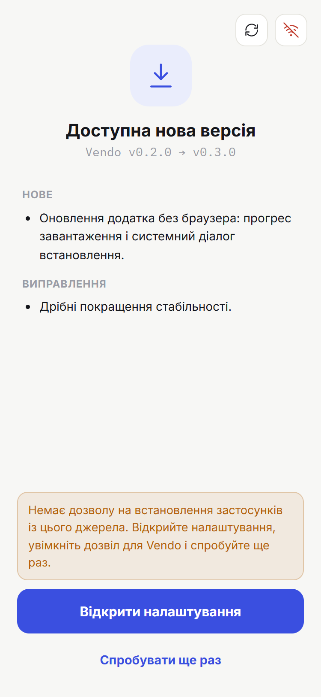

# 9. Налаштування

> **Коли це потрібно:** змінити вигляд чи мову, очистити дані або вийти.

Усе — у **меню профілю**: натисни **аватар** (кружок з ініціалами) угорі ліворуч на головному екрані.

## Тема
Перемикач **світла / темна**. Зберігається на пристрої.

## Мова
**Українська / англійська / російська**. Інтерфейс і повідомлення перемикаються одразу.

## Очистити дані
Прибирає кеш, чернетки та локальні налаштування списків. **Авторизація зберігається** (повторно входити не треба), дані заново завантажаться з офісу.
- Якщо є **невідправлені замовлення**, додаток **попередить** — спершу синхронізуйся, інакше їх буде втрачено.

## Оновлення додатка
Якщо вийшла нова версія, при запуску додаток показує **екран оновлення**: номер
нової версії і список змін.

1. Натисни **«Оновити до v…»** — додаток сам завантажить оновлення (видно смужку
   прогресу) і відкриє системний діалог встановлення.

   

2. Підтверди встановлення. **Дані й авторизація зберігаються.**
3. Не хочеш зараз — натисни **«Пізніше»**: кнопка оновлення залишиться в меню
   профілю, повернутися можна будь-коли.

Якщо система не дозволяє встановлення (перший раз так і буде), додаток покаже
попередження з кнопкою **«Відкрити налаштування»** — увімкни там дозвіл
*«Встановлення невідомих застосунків»* для Vendo, повернись і натисни
**«Спробувати ще раз»** (повторно завантажувати не доведеться).

Поточна версія додатка написана внизу меню профілю (наприклад, `Vendo v0.2.0`).
- Перевірка нових версій відбувається автоматично при запуску (потрібен інтернет);
  офлайн екран просто не з'являється.

## Вийти
Завершує сеанс і повертає на екран входу. Щоб зайти знову — потрібен **новий QR** від адміністратора.
