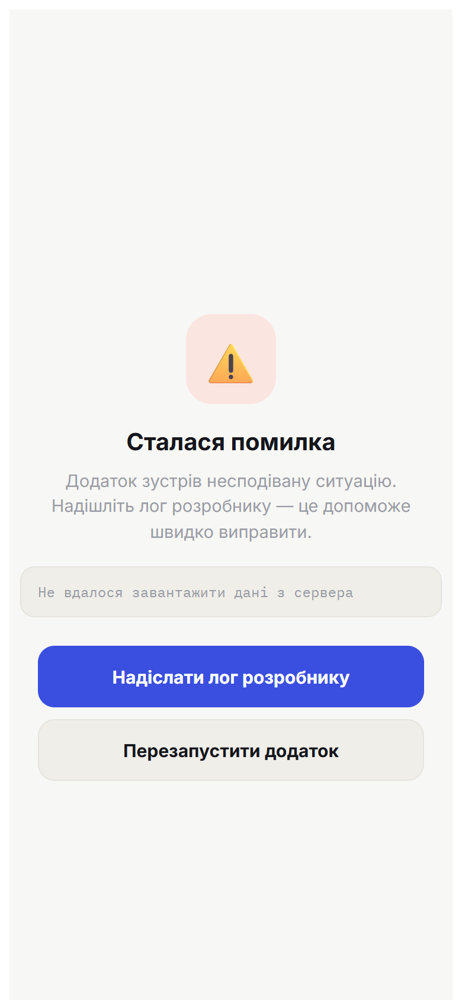
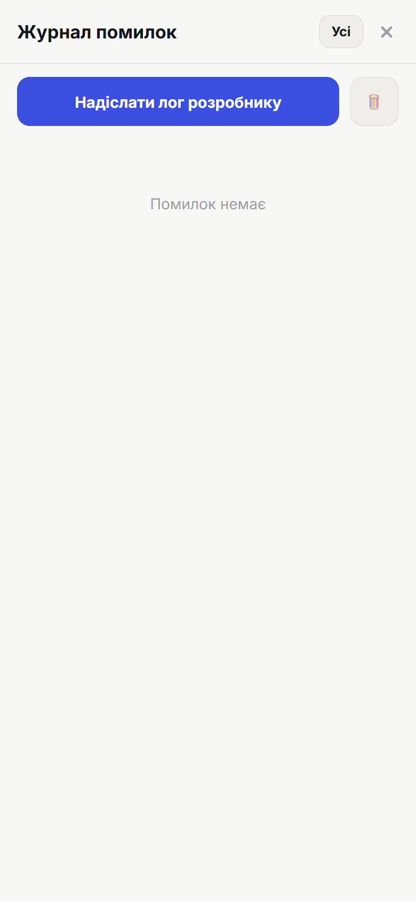
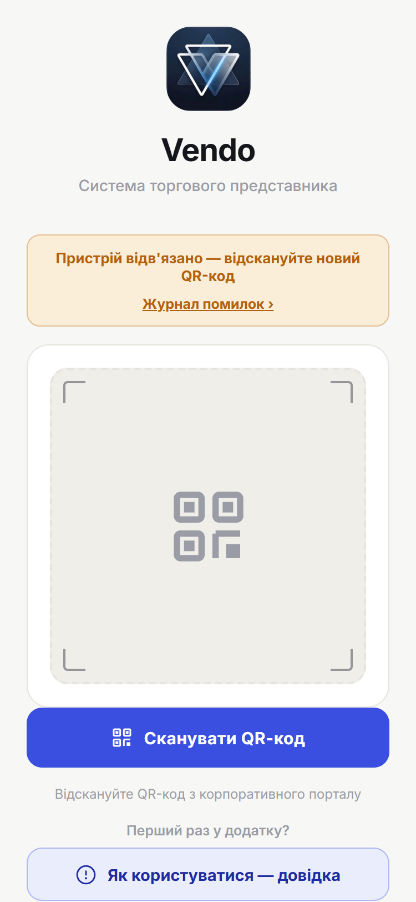

# 10. Якщо щось зламалось

> **Коли це потрібно:** додаток поводиться дивно, показав помилку або не оновлює дані.

## Екран «Сталася помилка»
Якщо щось пішло зовсім не так, замість білого екрана зʼявиться екран із поясненням.

- **Надіслати лог розробнику** — відкриє діалог «Поділитися»: надішли файл логу в месенджер або на пошту (це допоможе швидко полагодити).
- **Перезапустити додаток** — повертає до роботи.

## Надіслати лог вручну
Меню профілю → **Журнал помилок** → **«Надіслати лог розробнику»**. Там же видно останні події додатку.

## Викинуло на екран входу
Якщо в офісі перегенерували код прив'язки пристрою (або навмисно відв'язали його), додаток сам вийде на екран входу і покаже причину:

- Попроси в адміністратора **новий QR** і відскануй — усі дані, чернетки та невідправлені замовлення нікуди не діваються.
- Якщо це сталося неочікувано — натисни **«Журнал помилок ›»** прямо на цьому екрані й надішли лог розробнику (авторизація для цього не потрібна).

## Типові ситуації
- **Порожній екран замість даних** — немає звʼязку або сервер відповідає помилкою; угорі зʼявиться червоний банер. Спробуй пізніше або надішли лог.
- **Замовлення довго «очікує»** — натисни **Синхронізацію** за наявності інтернету (див. [розділ 6](06-offline.md)).
- **Дані застарілі** — потягни синхронізацію або зачекай: читання оновлюється у фоні автоматично.
- **Не вдається ввійти** — потрібен новий QR від адміністратора (див. [розділ 0](00-start.md)).
